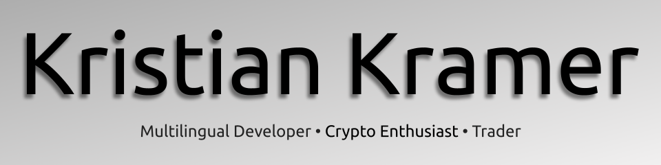

# __Hello, I'm [Kristian!](https://kristian-kramer.com)__ 👋

 
 

### I'm a 15 year old full stack programmer, crypto founder, entrepreneur, CEO, CTO, and more based in Aurora Colorado

🚀 Going beyond the impossible.

- ⌨️  CEO, CTO, and Founder of [Beyondcoin.io](https://beyondcoin.io), a cryptocurrency going beyond.
- ⌨️  CEO of BeyondGames, a multi-platform game studio.
- ⌨️  Former member of the Litecoin Foundation.
- 💡   Most recent project: [Beyondcoin](https://github.com/beyondcoin-project), a cryptocurrency that is going beyond the impossible.
- 🌱  Currently learning Golang, Rust, and assembly.

### ⚡️ Skills
- Experienced in C++, C, C#, Java, JavaScript, PHP, Bash, and more. 
- Web development expereience with HTML, CSS, JQuery, and more.
- Machine learning technologies include: Firebase, TensorFlow, and other platforms.
- Database experience with MySQL, SQL, SQLite, LevelDB, Redius, and MongoDB.
- Knows everything about blockchain and a lot about cryptography.

| Projects | Info | Occupation |
|--------------------------------------------------|------------------------------------------------------------------------------------------------|-----------------------------------------------------------|
| [Beyondcoin](https://beyondcoin.io) | A cryptocurrency going beyond the impossible. | CEO/CTO/Founder |
| [BeyondGames](https://beyondgames.io) | A multi-platfrom game studio going beyond. | CEO |
| [Testnet Faucet](https://testnet-faucet.com) | A multi-coin testnet faucet for developers. | Owner |
| [Testnet Pool](https://testnetpool.com) | The first public multi-coin testnet mining pool. | Owner |
| [Duinocoin](https://duinocoin.com) | A cryptocurrency that can be mined with Arduino boards. | Webmaster and contributor |

### 🌐 Links

- Website: <a href="https://kristian-kramer.com" target="_blank">kristian-kramer.com</a>
- Twitter: <a href="https://twitter.com/kristianjkramer" target="_blank">@KristianJKramer</a>
- Reddit: <a href="https://reddit.com/u/tech1k" target="_blank">@Tech1k</a>
- Linkedin: <a href="https://linkedin.com/in/kristian-kramer" target="_blank">Kristian Kramer</a>
- Medium: <a href="https://medium.com/@kristianjkramer" target="_blank">@KristianJKramer</a>

### 📈 Stats

 
 
